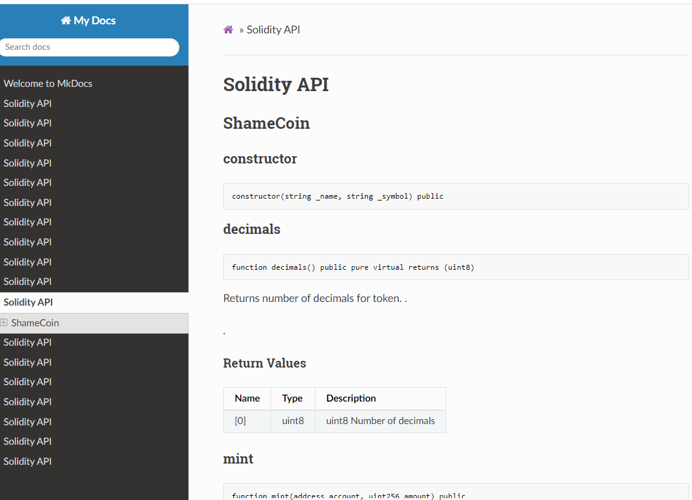

# Sample Hardhat Project

This project demonstrates a basic Hardhat use case. It comes with a sample contract, a test for that contract, and a script that deploys that contract.

Try running some of the following tasks:

```shell
npx hardhat help
npx hardhat test
REPORT_GAS=true npx hardhat test
npx hardhat node
npx hardhat run scripts/deploy.ts
```

For visualizing the documentation:
> - Install [mkdocs](https://www.mkdocs.org/)
> Run ```npx hardhat docgen``` 
> Start mkdocs server: 
>> - ```cd docs```
>> - ```mkocs serve```
>> - Go to ```localhost:8000```
>> 